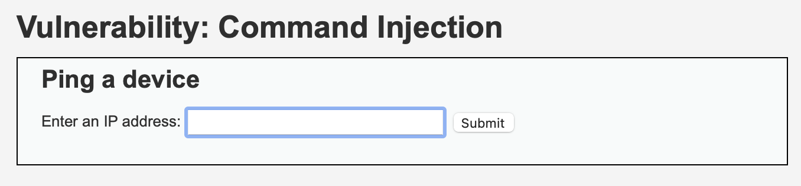
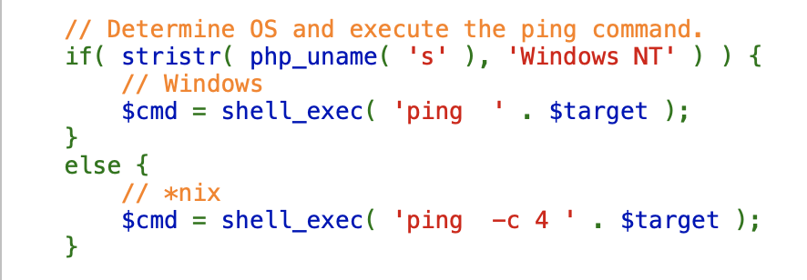
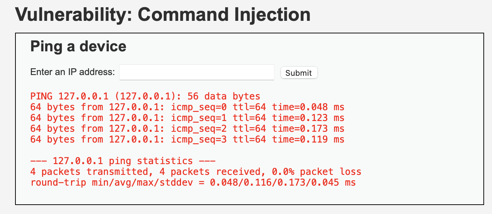
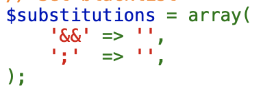
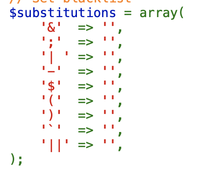

# COMMAND INJECTION

command injection은 취약점을 통해 관리자의 서버,OS에서 악의적인 명령어를 실행할 코드를 넣는것을 의미한다.  

이 기법의 핵심은 1개의 인자를 전달하는데, 1개 이상의 명령어가 실행될 수 있도록 하는것이다.  
 ;   ,   && ,   ||   
이것을 한줄에 여러 명령어가 실행되도록 하는 방법이다.
DVWA에 있는 예제로 설명을 진행한다.  

 

> [low]  

여기 DVWA에서 사용되는 예제에는 기본적으로 ping명령어를 사용한다.

먼저 소스를 확인해보자!
  
전달된 값을 그대로 명령어로 이용한다!  
이 웹페이지는 ip만 받는것을 목적으로 하겠지만 이 뒤에 다음과 같은 명령어를 같이 보낸다면 원하는대로 결과를 조작할 수 있다.  
127.0.0.1 && (실행할 명령어)  
<v>  
결과는 다음과 같다.  
  

>[medium]  

다음은 문제에서 커맨드를 막기위한 코드이다.  

&&와 ;을 없애는 작업을 진행한다. 이것을 우회하기 위해서는 다음과 같은 코드를 생각해 볼 수 있다.  
127.0.0.1 &;& dir  
127.0.0.1 || dir  
||을 막지 않았기 때문에 ||을 사용해도 되고, &;&을 사용한다면 ;만 사라지기 때문에 최종적으로 &&가 남게된다. 그래서 명령어가 실행되게 된다.  

>[high]

high에서도 문자열을 지우는 방식으로 우회를 막으려고 한다.  
코드를 보자.  
  
하지만 촘촘하게 막지 못한 모습이다.
여러가지 방법으로 우회가 충분히 가능하다.

127.0.0.1 |;||| pwd
127.0.0.1 |||| pwd
127.0.0.1 |;|; pwd
