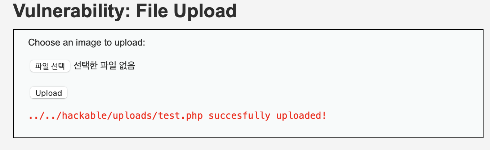
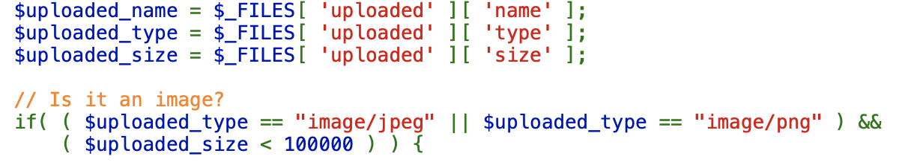
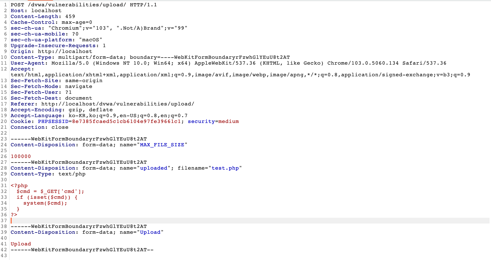

# File Upload Vulnerability
파일업로드 취약점은 서버에 마음대로 커맨드를 실행하도록 할 수 있는 파일을 업로드하고, 그 파일에 접근하여 서버에서 마음대로 커맨드를 실행할 수 있도록 하는 취약점이다.  

이 공격을 막기 위해서는 파일이 업로드 되는곳을 알려주거나, 접근할 수 있는 권한을 주어서는 안되며, 파일이 업로드 될 때 받을 파일이 맞는지 확인하는 과정이 필요하다.  

이 문제에서 문제를 일으킬 파일은 php파일로 서버에서 접근한다면 상시 사용할 수 있다.  
다음은 php파일의 소스이다.  

>\<?php  
	\$cmd = \$_GET['cmd'];  
	if (isset(\$cmd)) {  
		system(\$cmd);  
	}  
\?>  

DVWA에 있는 예제로 설명을 진행한다.    

>[low]  

low의 파일업로드 소스는 전혀 검사하는것이 아무것도 존재하지 않는다.
따라서 파일을 업로드하여 그 파일에 접근만 한다면 해결할 수 있다.  
  
심지어 파일의 주소까지 알려주고있다.  
http://localhost/dvwa/hackable/uploads/test.php
위의 주소에 내가 명령어로 넣고싶은것을 인자로 전달해주기만 하면된다.  
ex)http://localhost/dvwa/hackable/uploads/test.php?cmd=pwd

>[medium]

이 문제의 소스에서는 파일의 종류를 검사해주고 있다.  
  

이 파일의 종류를 검사하는 것은 mime-type을 이용한다.  
mime-type은 서버와 클라이언트 사이에서 파일의 종류를 알려주는 하나의 방법이다.  
파일을 서버에 전송할 때의 패킷을 intercept하면 다음을 볼 수 있다.  
  
이 사진에서 업로드한 파일 소스 위를 보면 content-type이 있는데 이것이 mime-type이다 이것을 수정한다면 파일의 종류를 속여서 업로드가 가능하다.  
이 값을 소스에서 원하는 값인 image/jpeg 혹은 image/png로 변경하여 업로드 해보자.  
