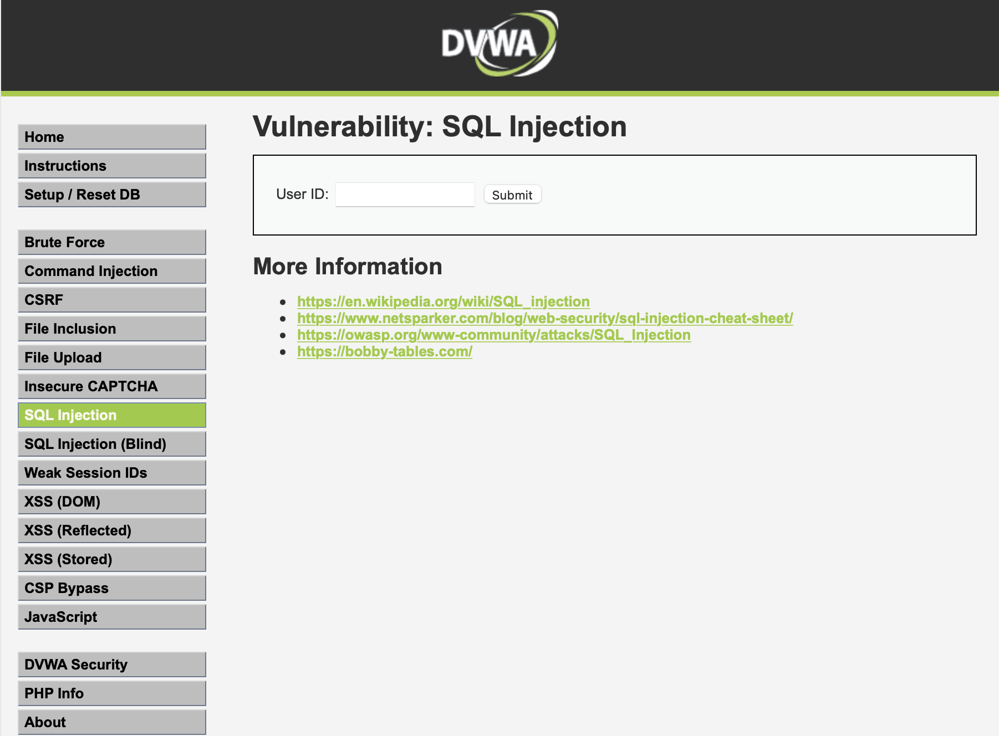
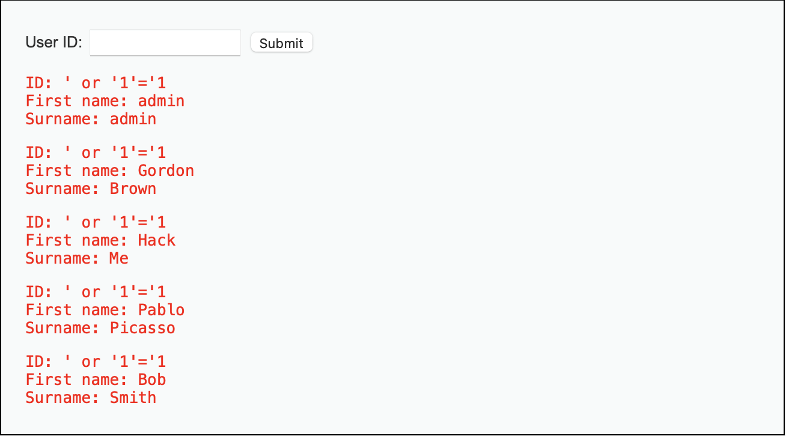
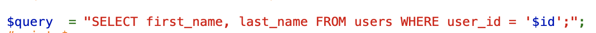
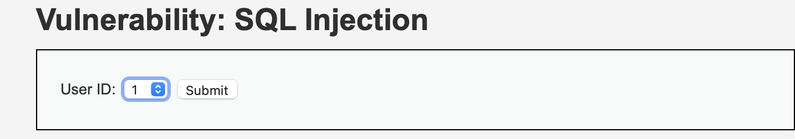
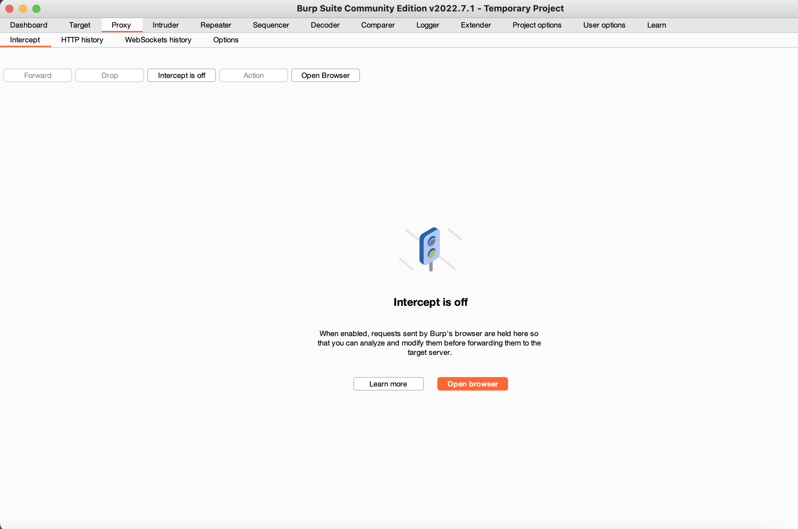
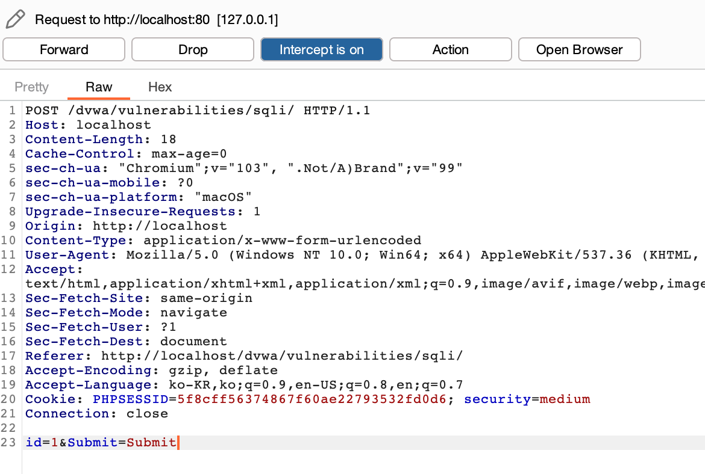
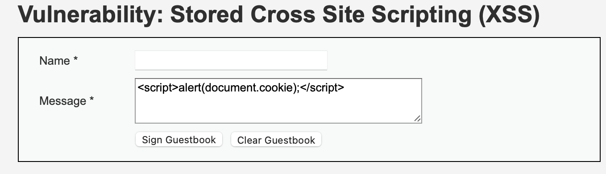
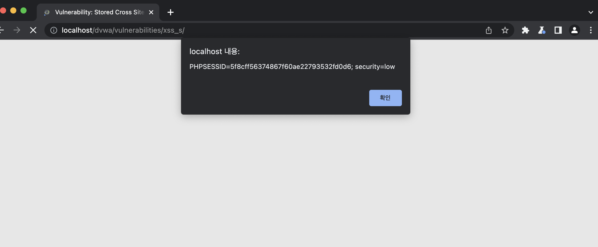
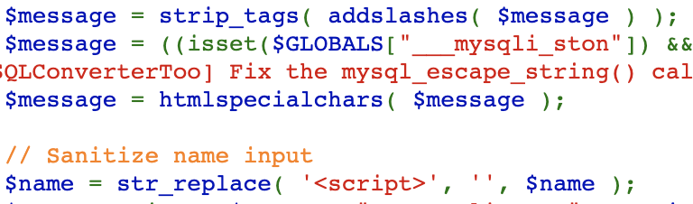
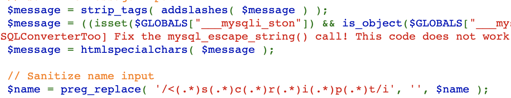

# SQL injection

SQL injection은 웹에서 쿼리에 값을 전달할 때, 쿼리문을 조작할 수 있는 값을 넣어 쿼리가 비정상적으로 작동하도록 만드는 기법이다.

다음 예시를 통해서 어떻게 적용될 수 있는지 살펴보자.  
테스트 환경은 DVWA이다.
> [low]  
> 

' or '1'='1 으로 low레벨을 풀 수 있다.  

  
이때 왜 ' or '1'='1 로 풀리는지 알아보도록 하자.  
다음은 소스코드이다.  

이 문제에서는 id값을 검사하지 않고 위의 쿼리문에 바로 들어게가 된다.  
그러면 user_id = '' or '1'='1'이 되므로 조건이 항상 참이므로 모든 값이 출력된다.  

>[medium]  

  
이 문제는 값을 직접 입력할 수 없도록 막아두었다!  
이상태에서 값을 조작하기 위해서 Burp Suite의 proxy로 넘어가는 값을 intercept하는 것이다.  

이후 밑의 id= 부분의 값을 수정하면 풀 수 있다.  

1 or 1=1
혹은
1 union select user_id, password from users;
로 풀 수 있다.  
위의 union은 쿼리문을 하나 더 실행하게 해주는 것이다.

>[high]  

high에서 중요한 것은 주석처리# 라고 볼 수 있다.
  
1' or '1'='1'#
를 입력하면 뒤의 LIMIT부분을 작동하지 않도록 만들 수 있다.
   
   

# XSS
XSS는 Cross Site Scripting 의 약자이다.  
게시물 같은곳에 스크립트를 써서 게시물을 보게되는 사람이 실행하지 않아도 자동으로 명령어를 실행하게 하고, 그 명령어는 그사람의 쿠키정보를 전송하는 방법등으로 사용된다.  
그래서 쿠키를 이용하여 세션(로그인정보)을 탈취한다.  

>[low]  

이처럼 값을 넣어주고 게시글을 작성하게 된다면  
게시글을 조회할 때 다음의 결과를 볼 수 있다.  

>[medium]  

여기서 부터는 스크립트를 사용하지 못하도록 막는 시도가 있다.  
소스를 확인해보자.

  
이 소스는 message에서는 스크립트를 사용할 수 없게 만들어놓았고  
name에서는 작동이 될 수 있다.
그런데 \   
이것을 name에 입력한다면 \<script>가 하나 사라지고 바깥에 있던 것이 스크립트를 작동시킬 것이다.  

>[hard]

여기의 소스를 한번 보자.  
  
이런! 이곳에서는 스크립트를 그냥 사용할 수 없도록 막아두었다!  
하지만 다른 코드로 우회할 수 있다!  
\<body onload="alert(document.cookie)">  
onload는 페이지에 들어오면 한번씩 작동하도록 만드는 코드이다.  
